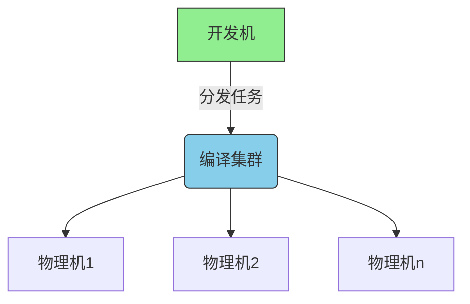

# dmdistcc - 分布式编译工具

结合distcc和ccache的分布式编译环境管理工具

## 主要功能

- 安全优先的distccd守护进程配置
- 多编译器版本支持（gcc/clang）
- 智能编译任务调度
- 本地缓存加速（ccache集成）
- 终端环境可视化状态提示
- 跨发行版支持（RHEL/Debian/Arch）

## 安装步骤

```bash
# 安装依赖
chmod +x install_depends.sh
sudo ./install_depends.sh

# 配置环境变量
echo "export DISTCC_HOSTS='192.168.1.0/24'" >> ~/.bashrc
source ~/.bashrc
```

## 使用指南

### 启动守护进程
```bash
./run_distccd.sh [允许的IP段]
# 示例：仅允许内网访问
./run_distccd.sh 192.168.1.0/24
```

### 编译模式选择
```bash
# 加载环境
source dmmode.sh

dmmode distcc    # 纯分布式编译模式
dmmode ccache    # 本地缓存编译模式 
dmmode both      # 分布式+缓存混合模式
dmmode reset     # 重置编译环境
```

### 高级功能
```bash
# 自定义编译器路径
export DM_CC=/opt/gcc-12/bin/gcc
export DM_CXX=/opt/gcc-12/bin/g++

# 实时监控
watch -n 1 distccmon-text
```

## 安全建议

1. 始终限制IP访问范围
2. 避免在公网环境使用0.0.0.0/0
3. 定期检查/var/log/distccd.log
4. 使用防火墙规则加固
```bash
sudo iptables -A INPUT -p tcp --dport 3632 -s 192.168.1.0/24 -j ACCEPT
```

## 网络拓扑建议


## 性能调优

根据集群规模设置-j参数：
```bash
# 建议值 = 节点数 × 核心数 × 1.5
make -j48
```

## 常见问题

Q: 出现版本不匹配错误怎么办？
A: 1. 确保所有节点使用相同编译器版本
   2. 设置DM_AUTO_VERSION_DETECTION="n"
   3. 手动指定编译器路径

Q: 如何验证分布式编译？
A: 执行基准测试：
```bash
time make -j clean all
